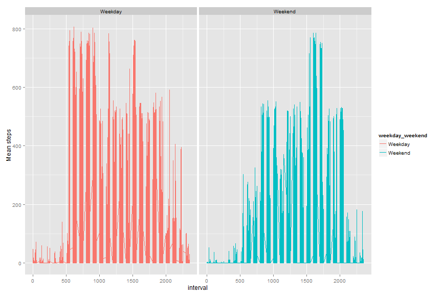

```r
library(knitr)
knitr::opts_chunk$set(fig.width=12, fig.height=8, fig.path='Figs/')
```

#Data Introduction
It is now possible to collect a large amount of data about personal movement using activity monitoring devices such as a Fitbit, Nike Fuelband, or Jawbone Up. These type of devices are part of the “quantified self” movement – a group of enthusiasts who take measurements about themselves regularly to improve their health, to find patterns in their behavior, or because they are tech geeks. But these data remain under-utilized both because the raw data are hard to obtain and there is a lack of statistical methods and software for processing and interpreting the data.

This assignment makes use of data from a personal activity monitoring device. This device collects data at 5 minute intervals through out the day. The data consists of two months of data from an anonymous individual collected during the months of October and November, 2012 and include the number of steps taken in 5 minute intervals each day.

#Loading and processing data
First, show the first few lines of data to have a look.

```r
data = read.csv("activity.csv", colClasses = "character")
head(data)
```

```
##   steps       date interval
## 1  <NA> 2012-10-01        0
## 2  <NA> 2012-10-01        5
## 3  <NA> 2012-10-01       10
## 4  <NA> 2012-10-01       15
## 5  <NA> 2012-10-01       20
## 6  <NA> 2012-10-01       25
```

This data contains three columns. We should transform the classes of these columns to make analysis easy. I will just transform the date in to "date class" and other columns into numeric.


```r
data$steps = as.numeric(data$steps)
data$date = as.Date(data$date, format = "%Y-%m-%d")
data$interval = as.numeric(data$interval)
str(data)######Double Check
```

```
## 'data.frame':	17568 obs. of  3 variables:
##  $ steps   : num  NA NA NA NA NA NA NA NA NA NA ...
##  $ date    : Date, format: "2012-10-01" "2012-10-01" ...
##  $ interval: num  0 5 10 15 20 25 30 35 40 45 ...
```

#What is mean total of steps taken per day
Use aggregate() function to generate a data frame contain steps per day.

```r
steps_per_day = aggregate(steps~date, data = data, FUN = "sum")
hist(steps_per_day$steps, breaks = 10, xlab = "Total number of steps per day", main = "Histogram of steps each day with NAs") 
```

 

Calculate mean steps per day and median of steps per day.


```r
median(steps_per_day$steps)
```

```
## [1] 10765
```

```r
mean(steps_per_day$steps)
```

```
## [1] 10766.19
```

#What is the average daily activity pattern?
Generate the mean of each interval across all days and plot

```r
mean_per_interval = aggregate(steps~interval, data = data , FUN = "mean")
plot(steps~interval, data = mean_per_interval, type = "l", main = "Mean steps at each interval")#Plot
```

 

```r
mean_per_interval[mean_per_interval$steps == max(mean_per_interval$steps),]
```

```
##     interval    steps
## 104      835 206.1698
```
It shows that the interval contains maximun mean steps is interval 835.

#Imputing missing values
##1, calculate the number of NAs in steps

```r
sum(is.na(data$steps))
```

```
## [1] 2304
```
There are 2304 NAs in "steps"

##2, We should look for which interval each NA value belongs to and assign value by generating normal random number with mean of the interval and standard deviation of the interval. Here are two functions I created: 
  a, assignNumber(interval, data). The function will generate a random number with normal distribution based on the mean and the standard deviation of the interval specified.
  b, assignAll(data) will assign all NAs in the data specified and generate a new number


```r
  mean_per_interval = aggregate(steps~interval, data = data , FUN = "mean") #Create a data frame containning the mean of each interval
  std_per_interval = aggregate(steps~interval, data = data, FUN = "sd")#Create a data frame containing the standard deviation of each interval
assignNumber = function(interval, data){
  mean_this_interval = mean_per_interval[mean_per_interval$interval == interval, "steps"] # get the mean of this interval
  std_this_interval = std_per_interval[std_per_interval$interval == interval, "steps"]# get the standard deviation of this interval
  number = rnorm(n = 1, mean = mean_this_interval, sd = std_this_interval)# Generate a random number based on mean and distribution
  if(number < 0){
    number = -number#Make negative values positive
  }
  #Make number a interger
  number = round(number, digit = 0)
}

assignALL = function(data){
  newdata = data#replicate the data so that it won't change the original data file that contains NAs.
  for(i in 1:nrow(newdata)){
    if(is.na(newdata$steps[i])){
      newdata$steps[i] = assignNumber(newdata$interval[i],newdata)
    }
  }
  return(newdata)
}
```

##3, Create a new dataset that is equal to the original dataset but with the missing data filled in.

Using the function just created generate a new dataset with no Nas


```r
withoutna = assignALL(data)
head(withoutna)
```

```
##   steps       date interval
## 1     1 2012-10-01        0
## 2     1 2012-10-01        5
## 3     0 2012-10-01       10
## 4     0 2012-10-01       15
## 5     1 2012-10-01       20
## 6    10 2012-10-01       25
```
##4, Make a histogram of the total number of steps taken each day and Calculate and report the mean and median total number of steps taken per day. Do these values differ from the estimates from the first part of the assignment? What is the impact of imputing missing data on the estimates of the total daily number of steps?

Make two histogram side by side so that we can compare

```r
steps_per_day_noNA = aggregate(steps~date, data = withoutna, FUN = "sum")
par(mfrow = c(2,1))
hist(steps_per_day_noNA$steps, breaks = 10, xlab = "Total number of steps per day", main = "Histogram of steps each day with assigned values to NAs")
hist(steps_per_day$steps, breaks = 10, xlab = "Total number of steps per day", main = "Histogram of steps each day with NAs") 
```

 

And report mean and median of the data 

```r
mean(steps_per_day_noNA$steps)
```

```
## [1] 12148.33
```

```r
median(steps_per_day_noNA$steps)
```

```
## [1] 11458
```

Compared to original result

```r
mean(steps_per_day$steps)
```

```
## [1] 10766.19
```

```r
median(steps_per_day$steps)
```

```
## [1] 10765
```

Hence after assigning values to NAs both mean and median increases. This is reasonable because it adds number of steps to the total steps perday by assigning values to NAs.

#Are there differences in activity patterns between weekdays and weekends?

I actually prefer make two plots on top of each other so that it is easier to figure out their difference.


```r
library(ggplot2)
library(timeDate)
```

```
## Warning: package 'timeDate' was built under R version 3.1.3
```

```r
withindicator = withoutna
withindicator["weekday_weekend"] = factor(isWeekend(data$date), labels = c("Weekday","Weekend"))
#####Create data frame with mean  of interval across weekday and weekend
steps_per_interval_withfactor = aggregate(steps~interval+weekday_weekend, data = withindicator, FUN = "mean")
with(withindicator,qplot(interval,steps, group = weekday_weekend, color = weekday_weekend, geom = "line", ylab = "Mean Steps"))
```

 

The main differences of weekday and weekend activities are:

* The weekday has high activity between interval 500-1000 while weekend does not.

This is probably because these people commute to walk in these intervals on weekdays while on weekends they sleep at this hour.

##At last I need to show that I know how to make panel plots right?

```r
qplot(interval,steps, data = withindicator, facets=.~weekday_weekend, geom = "line", color = weekday_weekend, ylab = "Mean steps")
```

 


```r
knit2html()
```

```
## Error in readLines(if (is.character(input2)) {: object 'input2' not found
```

